# Architecture Layer Stack

Liverpool FC Tracker — monolithic SPA architecture.

---

## Layer Diagram

```
Layer 5 - Entry:           src/main.jsx → src/App.jsx
Layer 4 - UI Components:   8 components in App.jsx
Layer 3 - Business Logic:  Filtering, sorting, stats aggregation (in App.jsx)
Layer 2 - Data:            PLAYERS, RSS_FEEDS, MOCK_NEWS (embedded in App.jsx)
Layer 1 - Utilities:       (none — lodash used directly)
Layer 0 - Config:          package.json, vite.config.js, index.html
```

## Dependency Flow

```mermaid
graph TD
    A[index.html] --> B[src/main.jsx]
    B --> C[src/App.jsx]
    C --> D[PLAYERS / RSS_FEEDS / MOCK_NEWS<br/>Embedded Data Constants]
    C --> E[8 UI Components<br/>PlayerCard, NewsFeed, etc.]
    C --> F[Business Logic<br/>Filtering, Sorting, Stats]
    C --> G[lodash<br/>External Utility]
    E --> D
    F --> D
    F --> G

    style A fill:#2d2d44,stroke:#C8102E
    style B fill:#2d2d44,stroke:#C8102E
    style C fill:#2d2d44,stroke:#C8102E,stroke-width:3px
    style D fill:#1a1a2e,stroke:#F6EB61
    style E fill:#1a1a2e,stroke:#F6EB61
    style F fill:#1a1a2e,stroke:#F6EB61
    style G fill:#1a1a2e,stroke:#666
```



## Layer Details

### Layer 0 — Config
| File | Purpose |
|------|---------|
| `package.json` | Dependencies: react 18.3, vite 6.0, lodash 4.17 |
| `vite.config.js` | Dev server on port 3000 |
| `index.html` | SPA shell, mounts `#root` |

### Layer 1 — Utilities
No custom utilities. Lodash imported directly in `App.jsx` for data manipulation.

### Layer 2 — Data
All data is hardcoded in `src/App.jsx`:
- `PLAYERS` (25 entries) — squad roster with stats, form, status
- `RSS_FEEDS` (7 entries) — news source configurations
- `MOCK_NEWS` (15 entries) — sample news items

### Layer 3 — Business Logic
Embedded in the `LiverpoolTracker` component:
- Player filtering by position, status, search term
- Player sorting by name, position, rating
- Stats aggregation via `useMemo`

### Layer 4 — UI Components
All defined in `src/App.jsx` (no separate component files):
`PlayerAvatar`, `FormBadge`, `StatBar`, `PositionTag`, `StatusBadge`, `PlayerCard`, `NewsFeed`, `RSSSourcesPanel`

### Layer 5 — Entry
- `src/main.jsx` renders `<LiverpoolTracker />` into `#root`
- Single route, no routing library

---

## Architecture Notes

- **Monolithic**: Everything lives in one file (`src/App.jsx`, ~630 lines)
- **No separation of concerns**: Data, logic, and UI are co-located
- **No external state**: React local state only (useState/useMemo)
- **No API layer**: All data is static/hardcoded
- **Inline styles only**: No CSS modules, styled-components, or Tailwind
